<!-- PROJECT LOGO -->

# Community Gate Keypad Project
## CS 460 Software Engineering

<!-- TABLE OF CONTENTS -->
## Table of Contents

* [Team T02](#team-t02)
* [Project Documents](#project-documents)
* [Built With](#built-with)
* [Document Structure](#document-structure)
* [Design Choices](#design-choices)
* [How to run this program](#how-to-run-this-program)
* [Usage Examples](#usage-examples)
* [Project Diagrams](#project-diagrams)

<!-- Team T02 -->
## Team T02
* Tanner Evans (Manager)
* Thomas Bowidowicz (Documents)
* Robin Acosta
* Marcos Lopez
* Jared Bock
* Jacob Varela

<!-- PROJECT Documents -->
## Project Documents

[Requirements Definition Document v3.0](https://lobogit.unm.edu/tannerjevans/CommunityGateKeypad/-/blob/master/docs/T02%20RDD%20v3.0.pdf)

[Software Requirement Specification v2.0](https://lobogit.unm.edu/tannerjevans/CommunityGateKeypad/-/blob/master/docs/T02%20SRS%20v2.0.pdf)

[Software Architecture Design Document v1.0](https://lobogit.unm.edu/tannerjevans/CommunityGateKeypad/-/blob/master/docs/T02%20SAD%20v1.0.pdf)

<!-- BUILT WITH -->
## Built With
* This program was built with Java (compatable with Java 8 or higher).

<!-- DOCUMENT STRUCTURE -->
## Document Structure:
Document                 | Description
--------------------     | --------------------
README.md                | Text file that contains information about the project.
.gitignore               | Contains the filetypes that will be excluded from the project repository.
 src/                    | Contains all the Java class files.
 docs/                   | Document directory that contains the RDD, SRS, and SAD documents.
 resources/              | Contains all diagrams created for this project. 
 CommunityGateKeypad.jar | .jar file containing the program.

<!-- Design Choices -->
## Design Choices
#### User Interface
* For simplicity and as a proof-of-concept any and all interaction with this program is done through the command-line.

<!-- HOW TO RUN -->
## How to run this program
  1. Download the .jar file.
  2. Open a new terminal/command window.
  3. Navigate to the directory where the .jar file is stored.
  4. Type the following into the command line, then hit "Enter".

        `java -jar CommunityGateKeypad.jar`

  5. Have fun with your very own Keypad program!  

<!-- USAGE EXAMPLES -->
## Usage Examples

* Correct Gate code entered

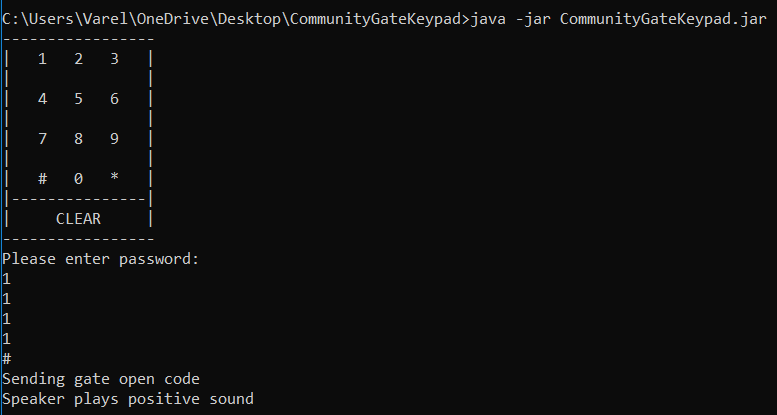

* Incorrect Gate code entered

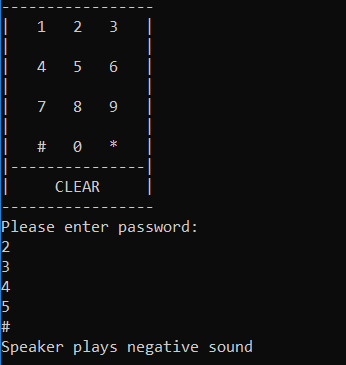

* Invalid input entered.

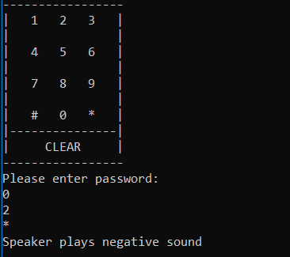

<!-- Project Diagrams -->
## Project Diagrams
*  Click on any of the diagram titles below to expand the corresponding diagram image. 

### Class Diagrams

<!--Legend Diagram -->

Legend 

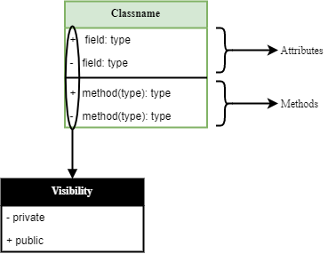
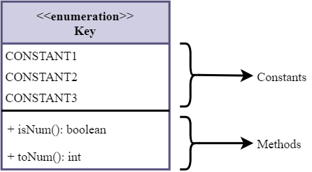
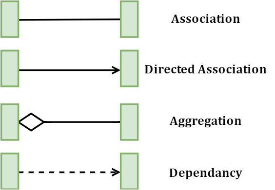

<!--Enums & Timer Diagram -->

Enums & Timer 

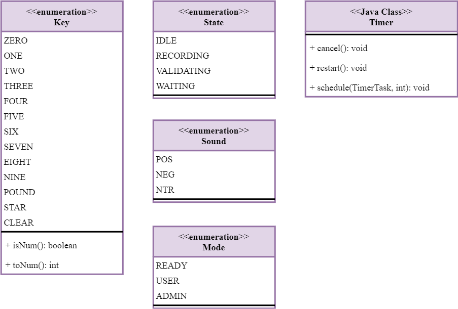

<!--Main Diagram -->

Main 

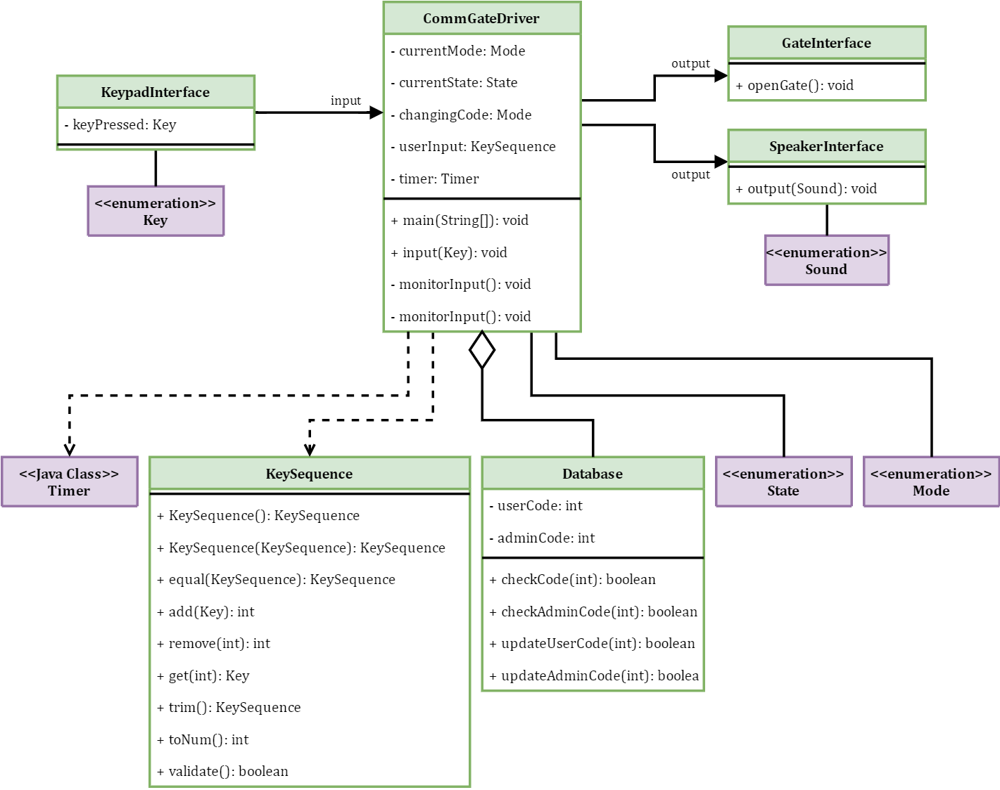

### State Diagrams

<!--Legend Diagram -->

Legend 

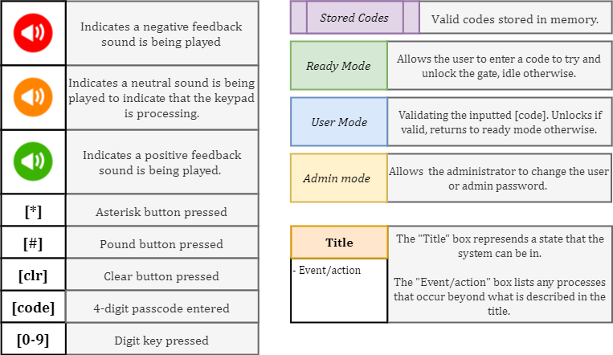

<!--Admin Mode Diagram -->

Admin Mode

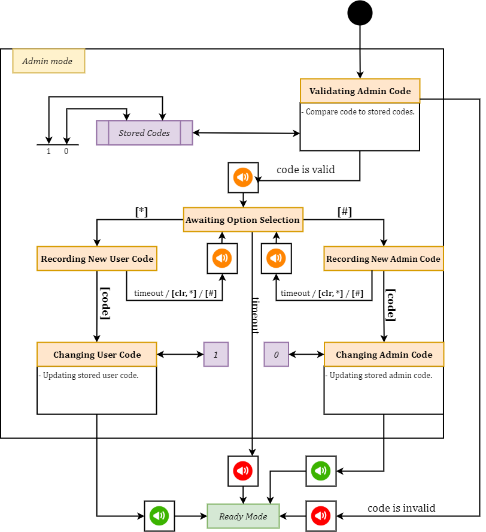

<!--Ready Mode Diagram -->

Ready Mode

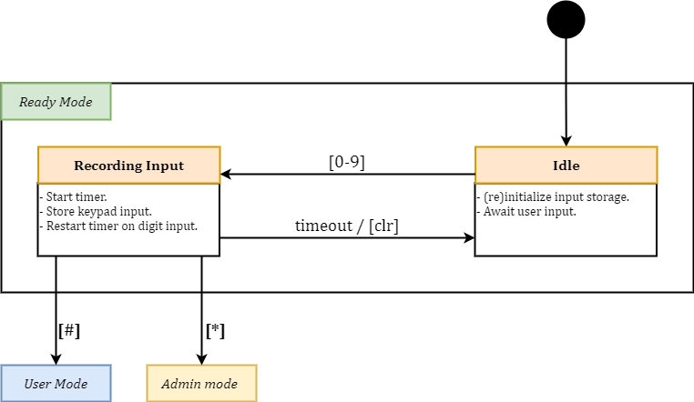

<!--User Mode Diagram -->

User Mode

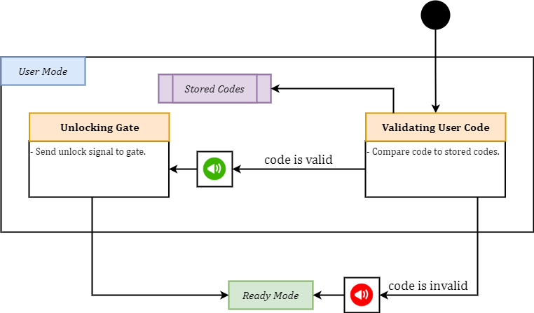

### System Diagrams

<!--Logical Diagram -->

Logical Block

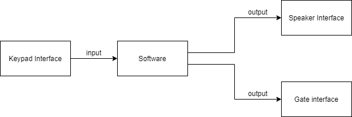

<!--Physical Block Diagram -->

Physical Block

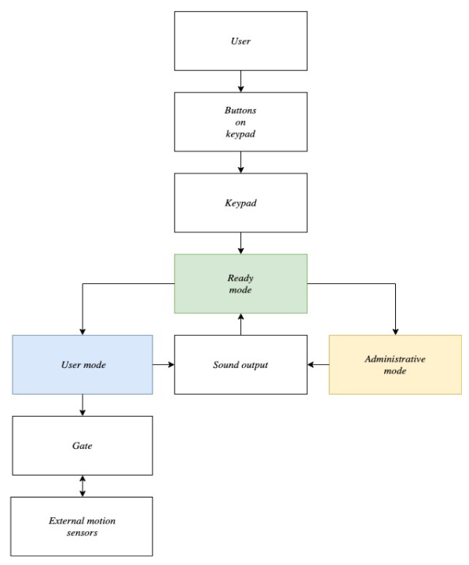

<!--System Organization Diagram -->

System Organization

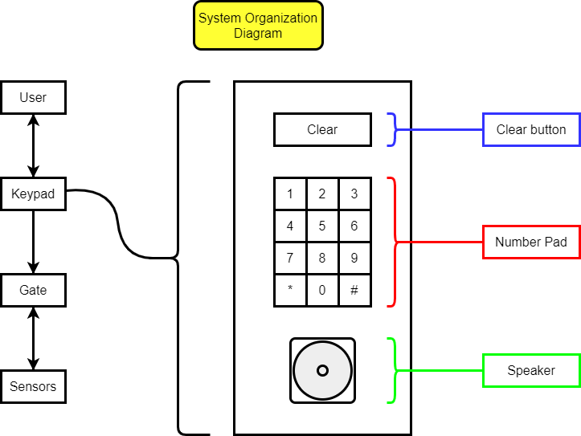

