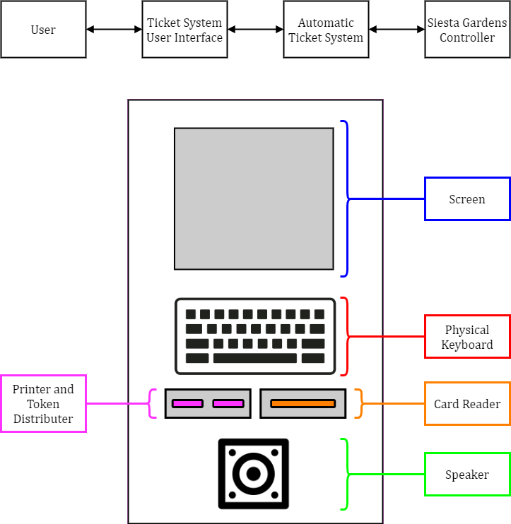
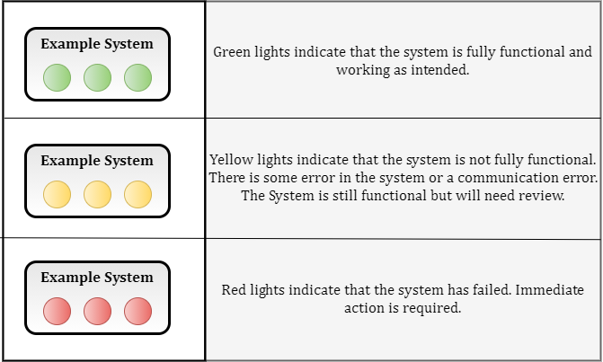
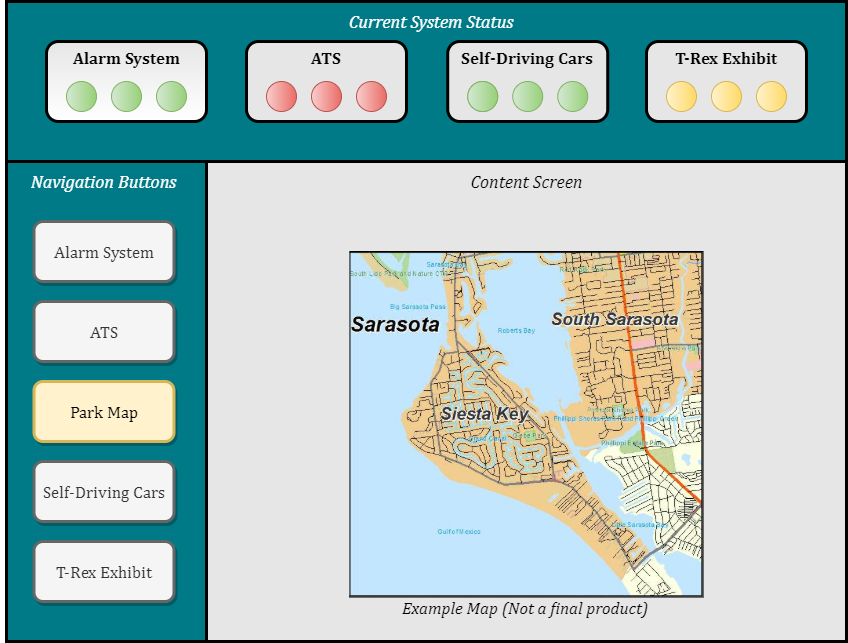

<!-- PROJECT LOGO -->

# Community Gate Keypad Project
## CS 460 Software Engineering

<!-- TABLE OF CONTENTS -->
## Table of Contents

* [Team T02](#team-t02)
* [Project Documents](#project-documents)
* [Built With](#built-with)
* [Document Structure](#document-structure)
* [Design Choices](#design-choices)
* [How to run this program](#how-to-run-this-program)
* [Usage Examples](#usage-examples)
* [Project Diagrams](#project-diagrams)

<!-- Team T02 -->
## Team T02
* Tanner Evans (Manager)
* Thomas Bowidowicz (Documents)
* Robin Acosta
* Marcos Lopez
* Jared Bock
* Jacob Varela

<!-- PROJECT Documents -->
## Project Documents

(URLS TBD...)

[Requirements Definition Document v?.0](https://google.com)

[Software Requirement Specification v?.0](https://google.com)

[Software Architecture Design Document v?.0](https://google.com)

<!-- BUILT WITH -->
## Built With
* This program was built with Java (compatable with Java 8 or higher).

<!-- DOCUMENT STRUCTURE -->
## Document Structure:
Document                 | Description
--------------------     | --------------------
README.md                | Text file that contains information about the project.
.gitignore               | Contains the filetypes that will be excluded from the project repository.
 src/                    | Contains all the Java class files.
 docs/                   | Document directory that contains the RDD, SRS, and SAD documents.
 resources/              | Contains all diagrams created for this project. 

<!-- Design Choices -->
## Design Choices
#### User Interface
* TBD...

<!-- HOW TO RUN -->
## How to run this program
  1. TBD... 

<!-- USAGE EXAMPLES -->
## Usage Examples

* TBD...

<!-- Project Diagrams -->
## Project Diagrams
*  Click on any of the diagram titles below to expand the corresponding diagram image. 

### Class Diagrams

(TBD...)
<!--Main Diagram 

Main 

-->

### System Diagrams

<!--Alarm System Logical Diagram -->

Alarm System Logical Diagram

<!--ATS Logical Diagram -->

ATS Logical Diagram

<!--ATS System Organization Diagram -->

ATS System Organization Diagram

<!--Self-Driving Cars Logical Diagram -->

Self-Driving Cars Logical Diagram

<!--T-Rex Sys_Exhibit Logical Diagram -->

T-Rex Sys_Exhibit Logical Diagram

<!--SGC Legend -->

SGC Legend

<!--SGC System Organization Diagram -->

SGC System Organization Diagram

